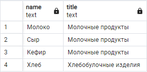

# Тестовое задание на C#

## Задание №1

*Напишите на C# библиотеку для поставки внешним клиентам, которая умеет вычислять площадь круга по радиусу и треугольника по трем сторонам.*

Из данного задания реализовано основное условие: программа с помощью библиотеки вычисляет площадь круга по радиусу, а также вычисляет площадь треугольника по трем сторонам.
Из дополнительных заданий было выполнено:
1. Юнит-тесты
2. Проверка на то, является ли треугольник прямоугольным
3. Свои проверки на коррректный ввод чисел

## Задание №2

*В базе данных MS SQL Server есть продукты и категории. Одному продукту может соответствовать много категорий, в одной категории может быть много продуктов. Напишите SQL запрос для выбора всех пар «Имя продукта – Имя категории». Если у продукта нет категорий, то его имя все равно должно выводиться.*

### Решение

Для начала неоходимо создать три таблицы, используя принцип "Многие-ко-многим":

```
CREATE TABLE products
(
  products_id int PRIMARY KEY,
  name text NOT NULL
);
CREATE TABLE categories
(
  categories_id int PRIMARY KEY,
  title text NOT NULL
);
CREATE TABLE products_categories
(
  products_id int REFERENCES products(products_id),
  categories_id int REFERENCES categories(categories_id),
  CONSTRAINT products_categories_pkey PRIMARY KEY (products_id, categories_id)
);
```

Чтобы производить какие-либо манипуляции, надо заполнить данные таблицы, что я и сделаю с помощью нижеописанного запроса:

```
INSERT INTO products
VALUES
  (1, 'Молоко'),
  (2, 'Сыр'),
  (3, 'Кефир'),
  (4, 'Хлеб');
INSERT INTO categories
VALUES
  (1, 'Молочные продукты'),
  (2, 'Хлебобулочные изделия');
INSERT INTO products_categories
VALUES
  (1, 1),
  (2, 1),
  (3, 1),
  (4, 2);
```

Выводим на экран все продукты:

```
SELECT name, title FROM products
	INNER JOIN products_categories ON products.products_id = products_categories.products_id
	INNER JOIN categories ON categories.categories_id = products_categories.categories_id
```

